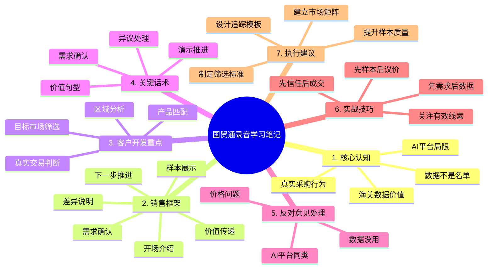

# 国贸通录音学习笔记（结构化版）

> 来源：优秀录音转写笔记
> 整理目的：清理口语化表达，提炼外贸客户开发实战知识点，便于导入 Skill 知识库与后续复盘。
> 适用场景：客户开发、电话沟通、线上演示、异议处理、成交推进。

---

## 1. 录音中的核心逻辑：不是“卖数据”，而是“卖真实需求与高质量客户”

### 1.1 客户开发的底层认知

在这些录音中，销售的共同逻辑是：

- 不是直接把“数据”当成产品来讲，而是把“真实采购行为”作为客户价值的核心。
- 不是广撒网找企业，而是找到“曾经真实发生过交易”的企业。
- 不是只靠关键词搜索，而是用海关/贸易数据识别真实需求和采购意图。
- 不是一上来讲价格，而是先让客户认可“数据真实、筛选有效、能帮助开发市场”。

### 1.2 数据的核心价值

最重要的价值主张可以概括为：

- 真实：企业必须有真实的进口/出口/报关记录，不能只是目录名单。
- 可验证：数据来自海关、交易记录、市场行为，便于筛选与判断。
- 可执行：可按国家、地区、产品、编码、交易行为筛选目标客户。
- 可转化：有助于提升邀约效率，减少无效沟通和低质量询盘。

### 1.3 与 AI / B2B 平台的核心区别

录音中反复强调的差异包括：

1. AI / 搜索平台：
   - 更容易找到大量潜在企业
   - 但难以判断企业是否真实采购
   - 可能出现同行、竞争对手、无效名单
   - 还需要大量时间做筛选和沟通

2. 海关数据 / 交易数据：
   - 能证明客户曾经真实发生过相关交易
   - 能判断其采购行为和产品需求
   - 更适合做精准开发和目标市场筛选
   - 更符合外贸销售中“高质量线索”的定义

### 1.4 对机械类客户特别重要的判断逻辑

机械及工业品客户的开发特点：

- 客户采购周期较长
- 交易往往存在重复性和周期性
- 目标客户不只是“有需求”，而是“曾经做过类似采购”
- 针对该类型客户，海关数据比泛平台更有说服力

因此，在销售中，重点不是“我们有多少客户名单”，而是：

- 这些客户是否真实存在采购行为
- 是否和公司产品有匹配度
- 是否能成为后续有效沟通对象

---

## 2. 录音中反复出现的销售结构：一套可复制的实战话术框架

### 2.1 通用销售流程

一套典型话术结构如下：

1. 开场：说明公司身份，为什么联系
2. 需求确认：了解国家、产品、市场、现状
3. 价值传递：说明数据来源与真实采购逻辑
4. 差异说明：区分 AI / 展会 / 平台 / 海关数据
5. 展示样本：让客户先看数据质量
6. 约下一步：演示、沟通、深入交流

### 2.2 电话沟通的高频句式

- “I noticed your company is active in this market, and I’d like to understand your current needs.”
- “We help companies identify buyers that have already had real trade activity.”
- “This is not just a list of names; it is based on actual customs and trade records.”
- “Many companies found via search or B2B platforms are not real buyers or not a good fit.”
- “If it helps, I can share a few sample records first so you can evaluate the quality of the data.”

### 2.3 线索筛选思路

在录音中，销售普遍强调：

- 先确认客户目标市场
- 再确认产品类别、国家、区域
- 再判断客户是否有数据工具或开发资源
- 最后给样本或做演示，建立信任

关键原则：

- 先“看需求”，再“讲数据”
- 先“看样本”，再“谈合作”
- 先“让客户认可价值”，再谈价格

---

## 3. 外贸实战中的关键知识点

### 3.1 市场开发：不要只看“市场大”，还要看“市场是否真实可开发”

录音中多次出现：

- 非洲是新开发市场，但需结合实际数据和商务资源评估
- 东南亚、欧美、俄罗斯、越南等地区都有各自数据公开度和采购特征
- 并不是所有国家都适合同一套开发方式

实际做法：

- 优先分析数据覆盖率
- 看目标市场是否具备真实进口/出口行为
- 判断目标客户是否存在稳定采购需求

### 3.2 客户筛选：从“能找到”到“能成交”

销售重点不是客户列表越大越好，而是：

- 是否真实存在采购行为
- 是否与产品匹配
- 是否具备沟通和决策权
- 是否符合目标市场需求

### 3.3 数据层级：从基础海关数据到更高价值的决策数据

在录音中，数据被分为不同层次：

- 基础海关数据：企业、产品、数量、金额、时间
- 交易行为数据：采购频率、产品方向、供应链行为
- 客户识别数据：采购商、贸易商、终端客户、采购人信息
- 增值数据：联系方式、决策人、商机筛选、行业判断

对销售来说，最有价值的是：

- 能从基础数据往“有用客户”延伸
- 能帮助外贸团队用更少资源做更多精准开发

### 3.4 价格与价值：不是卖“条数”，而是卖“开发效率”

录音里多次体现：

- 价格按国家、区域、市场需求、数据深度来定
- 不是固定统一价格，而是按用户需求定制
- 价值不是“拿到多少名单”，而是“找到多少真正有机会的客户”

因此，销售话术中常见的说法是：

- 我们的服务不是廉价名单，而是高价值线索和商机工具
- 价格要和结果、效率、筛选质量挂钩

---

## 4. 典型异议处理方法

### 4.1 “海关数据没用”

正确回应逻辑：

- 海关数据不是最终成单工具，但它是识别真实交易意图的重要基础
- 它提供的是“真实发生过采购行为”的证据
- 通过进一步筛选和分析，才能形成真正可开发客户

### 4.2 “AI / 展会 / 平台也能找到客户”

正确回应逻辑：

- 这些方式能找到“可能的企业”，但不能可靠判断“是否真实采购”
- 结果中常混入无效名单、无关企业、竞争对手
- 需要大量筛选、沟通和时间成本

### 4.3 “太贵”

正确回应逻辑：

- 数据不是简单购买名单，而是帮助客户提高开发效率
- 如果目标市场明确且筛选准确，实际转换价值会大于投入
- 售前应让客户先看样本、先评估价值，再谈费用

---

## 5. 这些录音里最值得复制的销售技巧

### 5.1 先确认需求，再讲产品

优秀录音的共性是：

- 先问客户做哪个国家、哪个产品、哪个市场
- 再判断客户是否已有需求和预算
- 再讲数据如何解决问题

### 5.2 先用样本建立信任

成功案例中非常典型：

- 先发样本
- 再做远程演示
- 再谈合作方案

这样可以减少客户对“海关数据”“平台”“价格”的顾虑。

### 5.3 让客户“看到真实数据”

客户通常更相信：

- 具体交易记录
- 产品型号
- 交易时间
- 量价信息
- 真实交易商家

而不是只听概念性的介绍。

### 5.4 用“行业判断”增加可信度

录音中经常会出现：

- 对市场公开度说明
- 对特定国家数据结构的判断
- 对客户产品的适配分析
- 对同行和实际采购行为的区分

这些能帮助销售形成专业感和可信度。

---

## 6. 适合导入 Skill 知识库的总结

### 6.1 外贸客户开发的原则

- 先找真实交易行为，再找客户
- 先做市场筛选，再做客户开发
- 先建立信任，再谈合作方案
- 先看数据质量，再谈价格和规模

### 6.2 外贸销售中的关键能力

- 识别客户市场需求
- 讲清数据真实价值
- 区分“名单”与“商机”
- 对比 AI / 展会 / 平台 / 海关数据
- 通过样本和演示形成信任
- 以专业逻辑推进下一步沟通

### 6.3 推荐的实际执行方法

- 每次电话前先定义：目标市场、目标产品、目标客户类型
- 沟通中优先验证客户真实需求
- 采用“数据 + 例子 + 样本 + 演示”的逻辑推进
- 以“有效线索”取代“名单数量”作为衡量标准

---

## 7. 一句话版总结

这份录音的核心知识点可以归纳为：

“外贸客户开发的关键不在于找到更多企业，而在于找到真实有采购行为、且与产品匹配的客户；海关数据的价值在于帮助销售从‘寻找可能客户’升级为‘识别真实商机’，从而提高邀约效率和成单可能性。”

---

## 8. Markdown 思维导图大纲

### 8.1 结构化思维导图大纲

- 国贸通录音学习笔记
  - 1. 核心认知
    - 数据不是名单，而是真实需求信号
    - 海关/交易数据的真实性
    - AI / 平台 / 展会的局限
  - 2. 销售框架
    - 开场介绍
    - 需求确认
    - 价值传递
    - 差异说明
    - 样本展示
    - 下一步推进
  - 3. 客户开发重点
    - 目标市场筛选
    - 产品与客户匹配
    - 真实采购行为判断
    - 重点国家/区域分析
  - 4. 关键话术
    - 价值句型
    - 需求确认句型
    - 异议处理句型
    - 样本演示句型
  - 5. 反对意见处理
    - 海关数据没用
    - 平台和 AI 也能找客户
    - 价格过高
  - 6. 实战技巧
    - 先确认需求，再谈数据
    - 先样本，再演示
    - 先建立信任，再谈价格
    - 关注有效线索而非名单数量
  - 7. 执行建议
    - 建立目标市场矩阵
    - 做客户筛选标准
    - 提升样本展示质量
    - 设计跟进演示模板

### 8.2 Mermaid 思维导图

---

## 9. 适合知识库的最终一句话总结

“外贸开发客户的关键不是数量，而是质量；不是找到更多企业，而是找到真正有采购行为、真正有需求、真正适合产品的客户。”
